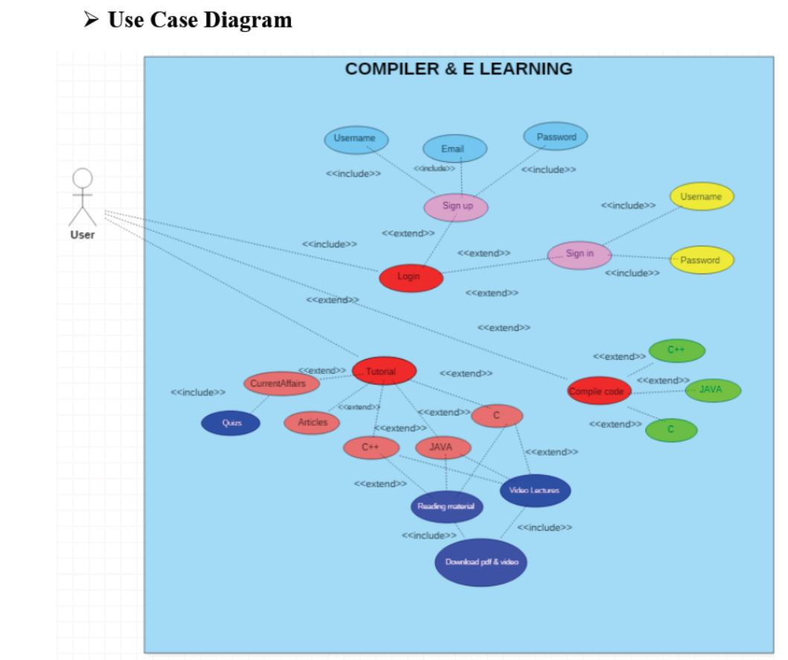
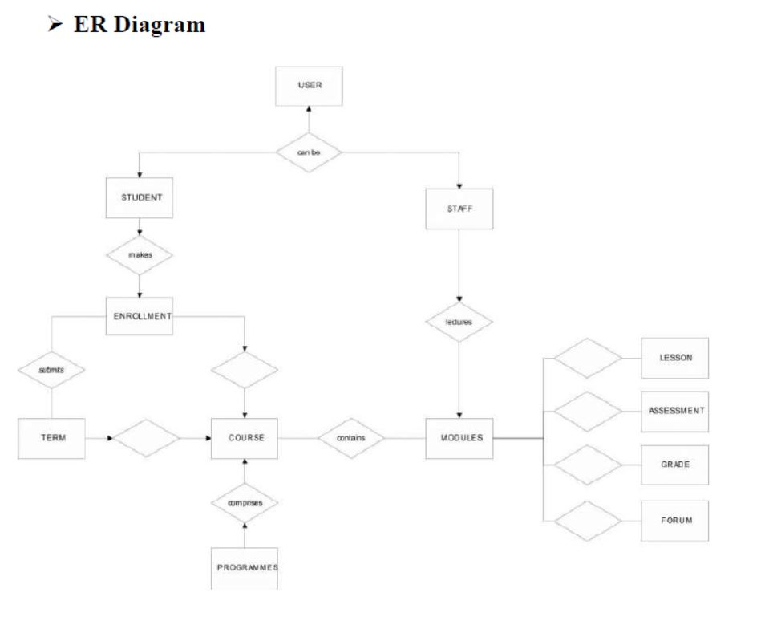
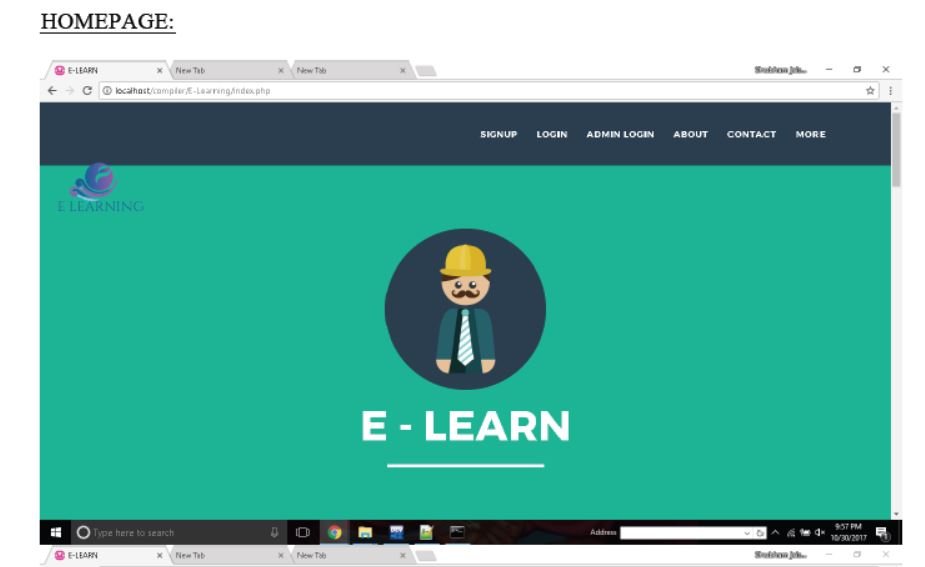
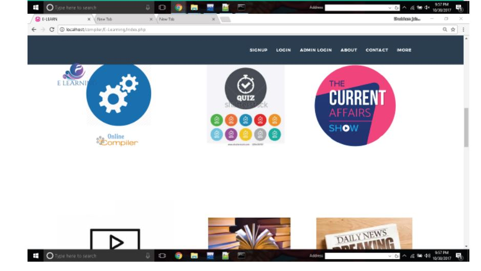
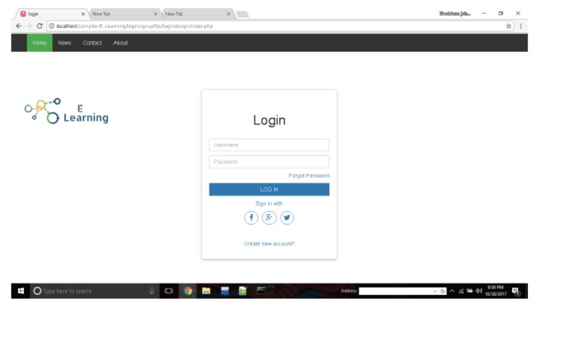
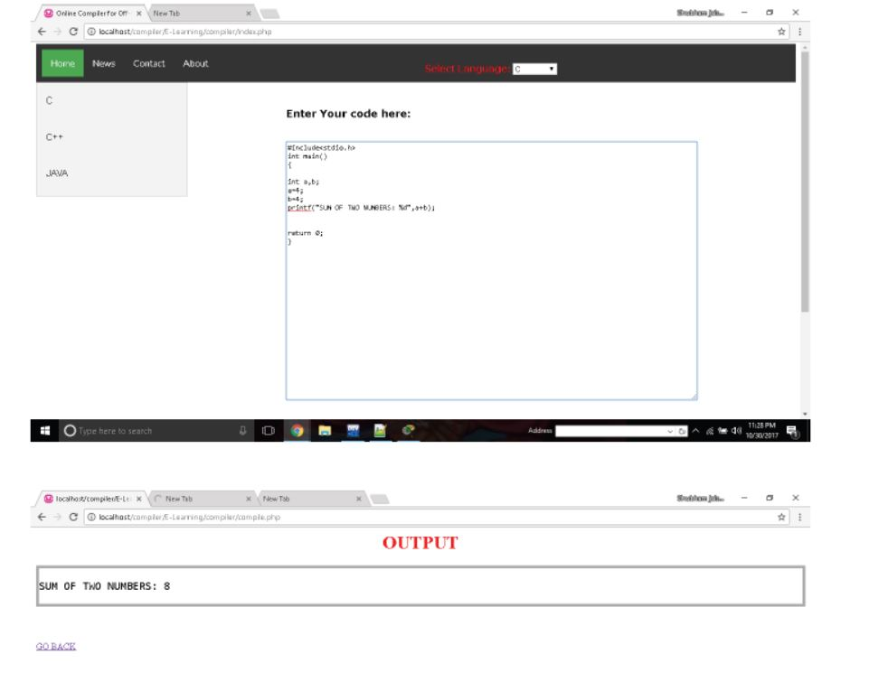
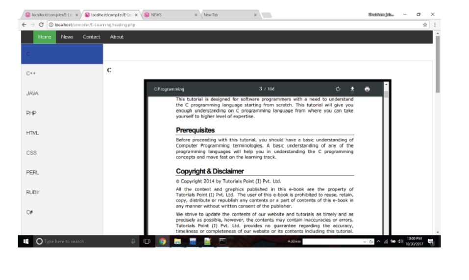
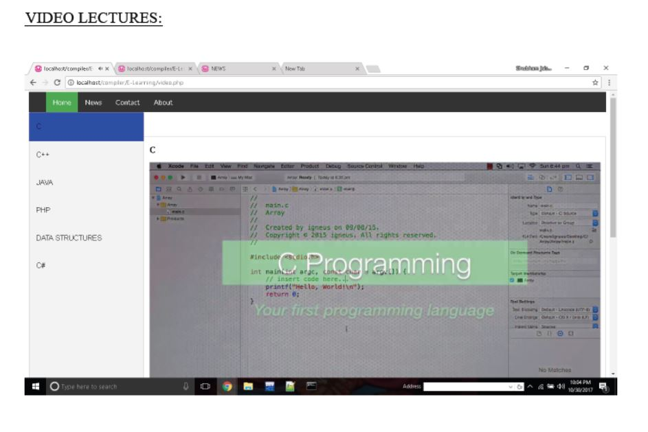

# E-learning
A learning system based on formalised teaching but with the help of electronic
resources is known as E-learning. While teaching can be based in or out of the
classrooms, the use of computers and the Internet forms the major component of Elearning.
E-learning can also be termed as a network enabled transfer of skills and
knowledge, and the delivery of education is made to a large number of recipients at
the same or different times. Earlier, it was not accepted wholeheartedly as it was
assumed that this system lacked the human element required in learning.

# E-learning-Portal
Elearning enables us to quickly create and communicate new policies, training, ideas, and concepts. Elearning reduces time away from the workplace, eliminates the need for travel, and removes the need for classroom-based training.

# Requirements=>

1) HTML
2) CSS
3) javascript
4) jQuery
5) json
6) php
7) mysql
8) Bootstrap

# Screenshots=> 
  
  
  
  
  
  
  
  

